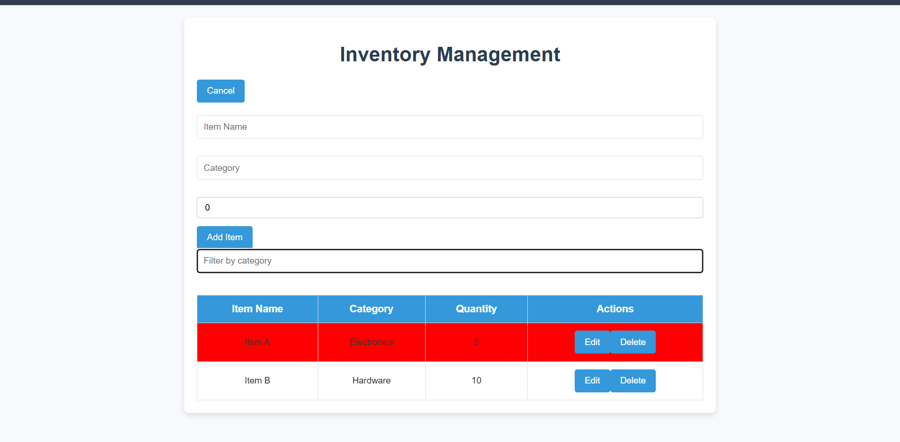

</img>

# Inventory Management Application

This is a simple React-based Inventory Management Application that allows users to add, edit, delete, filter, and sort inventory items. The app is built with React and styled using CSS.

## Features

- Add new items to the inventory.
- Edit existing inventory items.
- Delete items from the inventory.
- Filter items by category.
- Sort items by quantity (ascending or descending).
- Highlight low-stock items (quantity below 10) for better visibility.

## Prerequisites

To run this project, you need to have the following installed:

- [Node.js](https://nodejs.org/) (version 14 or later)
- npm or yarn (comes with Node.js)

## Getting Started

Follow these steps to set up and run the application locally:

### 1. Clone the repository
```bash
git clone <repository-url>
cd inventory-management-app

